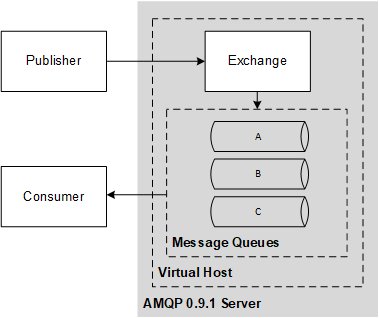

Highlights of the amqp 0.9.1 spec

# Overview

network protocol to enable client applications to communicate with messaging middleware server.

## why

It creates interoperability between clients and brokers.

lower the cost of enterprise and system integration.

## scope

AMQ Model: a set of components that route and store messages within the broker service, plus a set of rules for wiring these components together.

Network level protocol: Enables client to interact with the server and the AMQ Model.

## AMQ Model

A modular set of components and standard rules for connecting it.

The **exchange** receives messages from publisher applications and route these to "message queues", based on arbitrary criteria, usually message properties or content.

The **message queue** stores messages until they can be safely processed by a consuming client application (or multiple applications)

The **binding** defines the relationship between the "exchange" and the "message queue" and provides the message routing criteria.

This model emulates the message-oriented middleware concepts *store and forward queues* and *topic subscriptions*. It also enables *content-based routing*, *workload distribution* and *on-demand message queues*. 

## AMQP

AMQP is split in two layers

Functional: set of commands that do useful work on behalf of the application

Transport: carries these commands from application to server

having these two layers enables to change the transport  layer without impacting the application. or use the same transport layer for different high-level protocols.

## scale

it covers different levels of scale.

from:

- developer/casual use: 1 server, 1 user, 10 message queues, 1 message per second

...

- Market Data(trading): 200 servers, 5k users, 10k topics, 100k message per second (360M/hour)

## functional scope

- Store-and-forward with many writers and one reader.
- Workload distribution with many writers and many readers.
- Publish-subscribe with many writers and many readers.
- Content-based routing with many writers and many readers.
- Queued file transfer with many writers and many readers.
- Point-to-point connection between two peers.
- Market data distribution with many sources and many readers

# General Architecture

A middleware server: it is a data server that accepts messages and does two
main things with them:

1. it routes them to different consumers depending on arbitrary criteria
2. it buffers them in memory or on disk when consumers are not able to accept them fast enough

AMQP provides runtime-programmable semantics, through two main aspects:

* to create arbitrary exchange and message queue types
* to wire exchanges and message queues together to create any required message-processing system

## message queue

A message queue stores messages in memory or on disk, and delivers these in sequence to one or more
consumer applications. 

Message queues are message storage and distribution entities.

Examples of how they can be used: 

**store-and-forward:** holds messages and distrbutes these between consumers on a round robin basis. durable and shared between several consumers.

**private-reply queue:** holds messages and forwards these to a single consumer. tipically temporary.

**private subscription queue:** holds messages collected from various "subscribed" sources, and forward to a single consumer. tipically temporary.

## exchange 

accepts message from publisher and routes to a message queue based on pre arranged criteria. These criteria are called "bindings".

Exchanges decides how to forward these messages to message queues or other exchanges based on their binding tables.

amqp defines a number of exchanges types to cover the fundamental types of routing nedded to do a common message delivery.

## routing key

an exchange examines a message's properties, its header fields, and its body content, and using this and possibly data from other sources, decides how to route the message.

In the majority of simple cases the exchange examines a single key field, which we call the "routing key". The routing key is a virtual address that the exchange may use to decide how to route the message.

* For point-to-point routing, the routing key is usually the name of a message queue.
* For topic pub-sub routing, the routing key is usually the topic hierarchy value.

## message lifecycle

The producer chooses how unroutable messages are treated.

When a message arrives in a message queue, the message queue tries immediately to pass it to a consumer application via AMQP. If this is not possible, the message queue stores the message (in memory or on disk as requested by the producer) and waits for a consumer to be ready. If there are no consumers, the message queue may return the message to the producer via AMQP (again, if the producer asked for this).

The consumer chooses how and when messages are “acknowledged”. The consumer can also reject a message (a negative acknowledgement).

## what the producer sees

a producer does not send messages directly to a message queue. 

## what the consumer sees

However, we also allow AMQP client applications to:

* create or destroy message queues;
* define the way these message queues are filled, by making bindings;
* select different exchanges which can completely change the routing semantics.

## automatic mode

* default exchange for message producers
* default binding for message queues that selects messages based on a match between the routing key and the message queue name

It does, however, let one use AMQP without needing to understand how exchanges and bindings work.

## Exchanges

* direct exchange (same as the default exchange): which routes on a routing key
* topic exchange: routes on a routing pattern

## exchange lifecycle

Each AMQP server pre-creates a number of exchanges (cannot be destroyed).

AMQP applications can also create their own exchanges. 

They use an assertive "declare" method which means, "create if not present, otherwise continue"

## message queue properties

name: if unspecified, the server decides. Applications agree on name beforehand, or when using a temporary the server provides a name.

exclusive: only to that connection, deleted when connection is closed.

durable: queue presents active when server restarts

## message queue lifecycle

durable queue: shared by many consumers and have independent existence.

temporary queue: private to one consumer, if the consume disconnects the queue is deleted.

## bindings 

Bindings are constructed from commands from the client application (the one owning and using the message queue) to an exchange.

## Connection class

The connection is designed to be long-lasting, and can carry multiple channels.

## Channel class

Channels provide a way to multiplex a heavyweight TCP/IP connection into several light weight connections

It is expected and encouraged that multi-threaded client applications may often use a “channel-per-thread”
model as a programming convenience

# Functional Specification

## message and content

a message is the atomic unit of processing of the middleware routing and queue system.

message has content, which consists of a header and a body.

messages may be persisted to a disk to guarantee the delivery

messages may have a priority level

the server doest no modifies the content body of the message.

## exchanges

Exchanges may be durable, temporary, or auto-deleted

Durable exchanges last until they are deleted.

Temporary exchanges last until the server shuts-down. 

Auto-deleted exchanges last until they are nolonger used.

## fanout exchange type

1. a message queue binds to the exchange with no arguments
2. a publisher sends the exchange a message
3. the message is routed to the message queue unconditionally.

## message queue

A message queue is a named FIFO buffer that holds message on behalf of a set of consumer applications

The only way to guarantee FIFO is to have just one consumer connected to a queue.

## acknowledgements

An acknowledgement is a formal signal from the client application to a message queue that it has successfully processed a message.

1. automatic: server removes content from a message queue as soon it delivers it to an application
2. explicit: the client application must send an Ack method for each message
