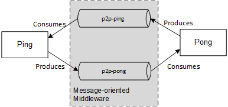
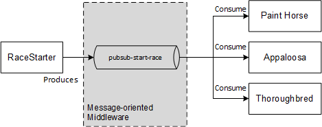

# Comparsion of Message Oriented Middleware's Java Client libraries
Comparsion of Message Oriented Middleware's Java Client libraries

## P2P Example - Ping and Pong
* `Ping` - Listens to the `p2p-ping` queue, prints `ping` and sends a message to `p2p-pong`.
* `Pong` - Listens to the `p2p-pong` queue, prints `pong` and sends a message to `p2p-ping`.

### JMS Implementations 
#### Using ActiveMQ Classic
* [Active MQ Client through TCP](https://github.wdf.sap.corp/I840973/java-mom-client/tree/master/mom-activemq-classic)
* [Apache Qpid JMS Client through AMQP 1.0](https://github.wdf.sap.corp/I840973/java-mom-client/tree/master/mom-activemq-qpid)

#### Using RabbitMQ 
* [RabbitMQ JMS Client through AMQP(version??)](https://github.wdf.sap.corp/I840973/java-mom-client/tree/master/mom-rabbitmq-jms)

### Spring JMS Implementation
p.s. JMS implementations still required, any of the above.
* [Spring JMS connecting with ActiveMQ or RabbitMQ through AMQP or TCP](https://github.wdf.sap.corp/I840973/java-mom-client/tree/master/mom-spring-jms)

### AMQP 0.9.1 Implementations

#### Using RabbitMQ

* 2 Direct exchange with queue

## Pub/Sub Example - Horse Race
* `RaceStarter` - Publishes to the `pubsub-start-race`.
* `Appaloosa`, `Thoroughbred`, `PaintHorse` - Subscribes to `pubsub-start-race` when created. Prints when receives the message notification.

### JMS Implementations 
#### Using ActiveMQ Classic
* [Active MQ Client through TCP](https://github.wdf.sap.corp/I840973/java-mom-client/tree/master/mom-activemq-classic)

### AMQP 0.9.1 Implementations

#### Using RabbitMQ

- Topic exchange with matching route
- fanout exchange

## Notes

### JMS
* Java applications should rely on JMS. Using the JMS specification decouples our application code and the message-oriented middleware. Same as JPA does for database.
* There are two versions of JMS (1.1 and 2.0). 1.1 is synchronous and verbose, while 2.0 is assynchronous and simplified. It's retrocompatible though.
* JMS is not supported by all the MoMs. Some don't support at all (e.g. GCP Pub/Sub), some only support version 1.1.
* JMS does *not* enforces a communication protocol.
* For Spring Applications, spring provides a wrapper on top of the JMS API.
